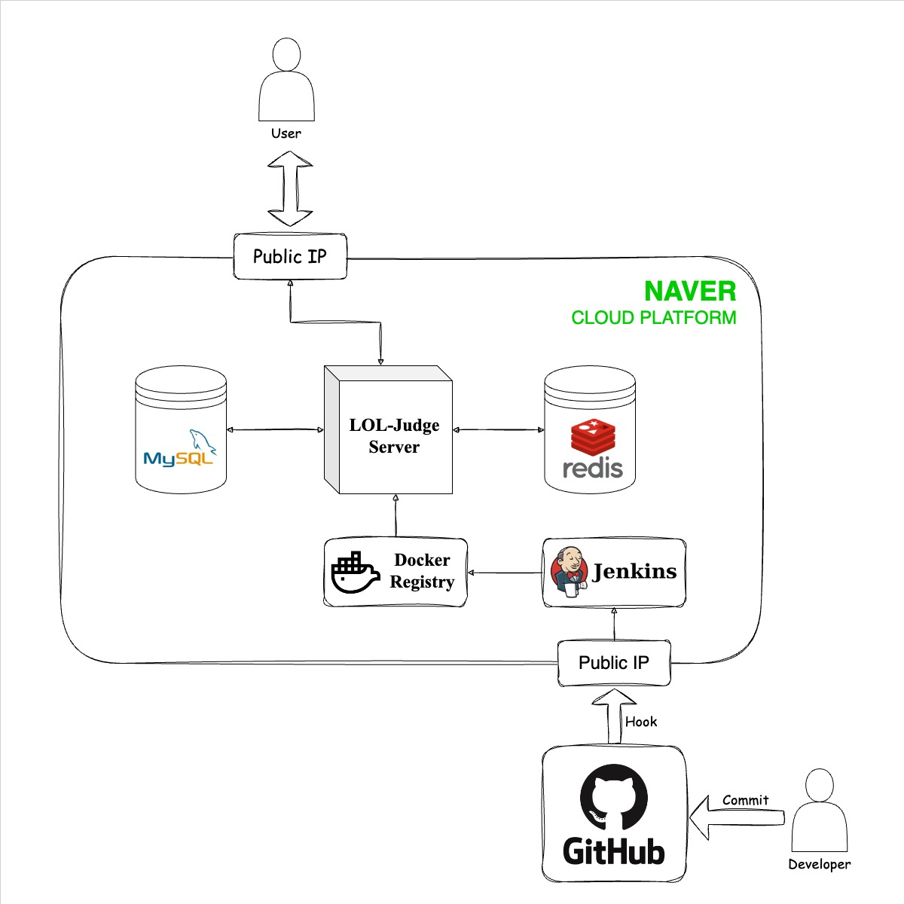

# 👋 lol-judge 서비스 소개

리그오브레전드 인게임 논쟁 상황에 대해 토론, 투표하는 서비스

 

# :dart: 프로젝트 목표

- 실제 사용 가능한 서비스를 목표로 합니다.
- 동시 접속자 10000명 환경을 고려한 기능 구현
- 비즈니스 요구사항을 실현하기 위한 최적의 방법 탐색 및 활용
- 객체지향 원리, 디자인 패턴 등을 접목한 깨끗한 코드 구현
- 단위 테스트에 집중하여 신뢰성 높은 코드 구현

 

# 🏗️ 시스템 구조

 

# 🔥 기술적 이슈 해결 과정

- #6 CI/CD 파이프라인 구축
    - [CI/CD 파이프라인 구축(1) - CI/CD란?](https://cookie-dev.tistory.com/19)
    - [CI/CD 파이프라인 구축(2) - 빌드 자동화](https://cookie-dev.tistory.com/20)
    - [CI/CD 파이프라인 구축(3) - 배포 자동화](https://cookie-dev.tistory.com/21)

- #4 로그인, 로그아웃 구현
    - [롤문철 닷컴 구현기 2탄 - 로그인 기능 구현](https://cookie-dev.tistory.com/23)
    - [롤문철 닷컴 구현기 3탄 - 로그인 체크 (AOP vs 필터 vs 인터셉터)](https://cookie-dev.tistory.com/24)

 

# 🔀 브랜치 관리 전략

트렁크 기반 개발 방법을 실천합니다.

- `master` 라는 주 브랜치 하나를 운용
- 최대한 작은 단위의 피쳐 브랜치 만들어서 작업하고 며칠 내로 PR(Pull Request)를 올려 코드 리뷰 진행
- 피쳐 토글을 활용하여 릴리즈의 안정성 향상

### 브랜치 관리 전략 참고 문헌

- [맘시터 기술 블로그](https://tech.mfort.co.kr/blog/2022-08-05-trunk-based-development/)
- [Trunk based Development Document](https://trunkbaseddevelopment.com/)

 

# 📑 기술 문서

- [프로토타입](https://ovenapp.io/view/p7rtuX2Mob2J9Fy1S45aQQCQtcKLOFSh/aFM0B)
- [세부 기능 명세서](https://github.com/f-lab-edu/lol-judge/wiki/%EC%84%B8%EB%B6%80-%EA%B8%B0%EB%8A%A5-%EB%AA%85%EC%84%B8%EC%84%9C)
- [ERD](https://github.com/f-lab-edu/lol-judge/wiki/ERD-%EC%84%A4%EA%B3%84)
- [use-case 다이어그램](https://github.com/f-lab-edu/lol-judge/wiki/usecase-%EB%8B%A4%EC%9D%B4%EC%96%B4%EA%B7%B8%EB%9E%A8)

 

# 🚀 개발 일정

- [개발 현황판](https://github.com/orgs/f-lab-edu/projects/105)
